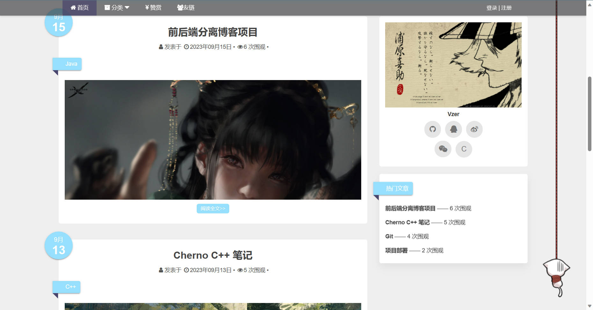
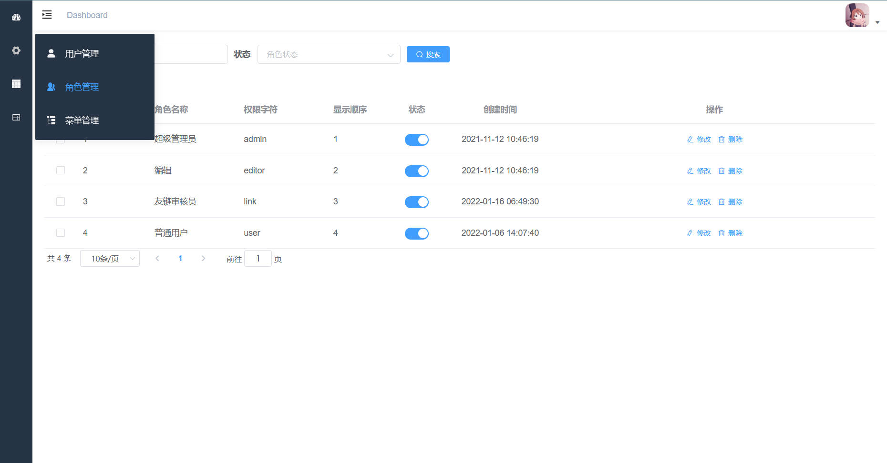
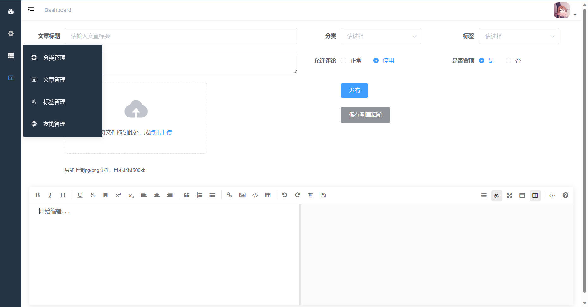

# 前后端分离博客项目

## 项目介绍

前后端分离博客项目

技术栈: SpringBoot + Mysql + Redis + Swagger2 + MyBatisPlus + Maven

项目功能: 

- 多模块, 分为博客前台与博客后台

- 前后端分离, Docker Compose 部署

- 实现日志管理, 定时任务管理, 上传文件

前台实现: 

- 查询文章, 文章分类, 文章置顶, 浏览量相关

- 发布评论, 回复评论

- 友链

- 个人信息, 用户注册与登录

后台实现:

- 用户登录

- 写博文功能

- 用户, 角色, 权限控制与管理

- 文章, 分类, 标签, 友链管理

- Excel导出

## 运行环境

openjdk: 8

mysql: 8.0.19

redis: 6.0.8

nginx: 1.18.0

服务器: 腾讯云 2 核 2G Ubuntu20.04

对象存储: 七牛云 OSS

## 项目地址

[前台](http://43.139.40.2:8093/#/)

[后台](http://43.139.40.2:8094/#/)

## 项目截图

  

  

  

  

## 鸣谢
[参考视频](https://www.bilibili.com/video/BV1hq4y1F7zk/)

[参考笔记](https://www.yuque.com/huanfqc/my-blog/myblog)